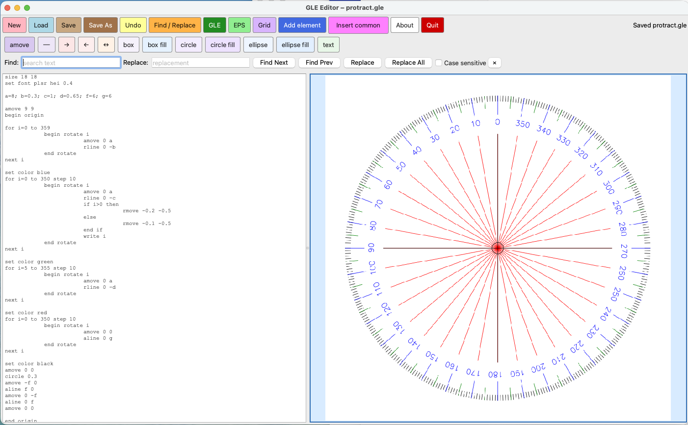

# GLE Editor

GLE Editor is a macOS-friendly graphical editor for **GLE (Graphics Layout Engine)** files,
with an integrated live PDF preview. It is designed to make it easier to write, edit,
and visually build GLE diagrams while keeping the source `.gle` file and rendered output close together.

GLE itself is available on https://glx.sourceforge.io


## Features

- Side-by-side **GLE source editor** and **PDF preview**
- Built-in **render-to-PDF** and **render-to-EPS** commands
- Automatic detection of the `gle` executable on macOS
- Manual configuration of the GLE path if it is not found automatically
- **Autosave** after a short pause while typing
- **Find / Replace** support
- Insert-ready common GLE snippets
- Click-to-insert tools for common drawing commands:
  - `amove`
  - `aline`
  - arrows
  - boxes
  - filled boxes
  - circles
  - filled circles
  - ellipses
  - filled ellipses
  - text
- Optional **grid overlay** in the preview
- Restores the last file and window position on startup




## Requirements

### Python packages

Install the Python dependencies with:

```bash
pip install PySide6 PyMuPDF

